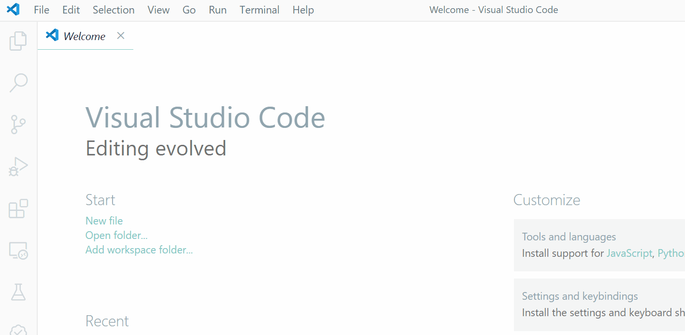
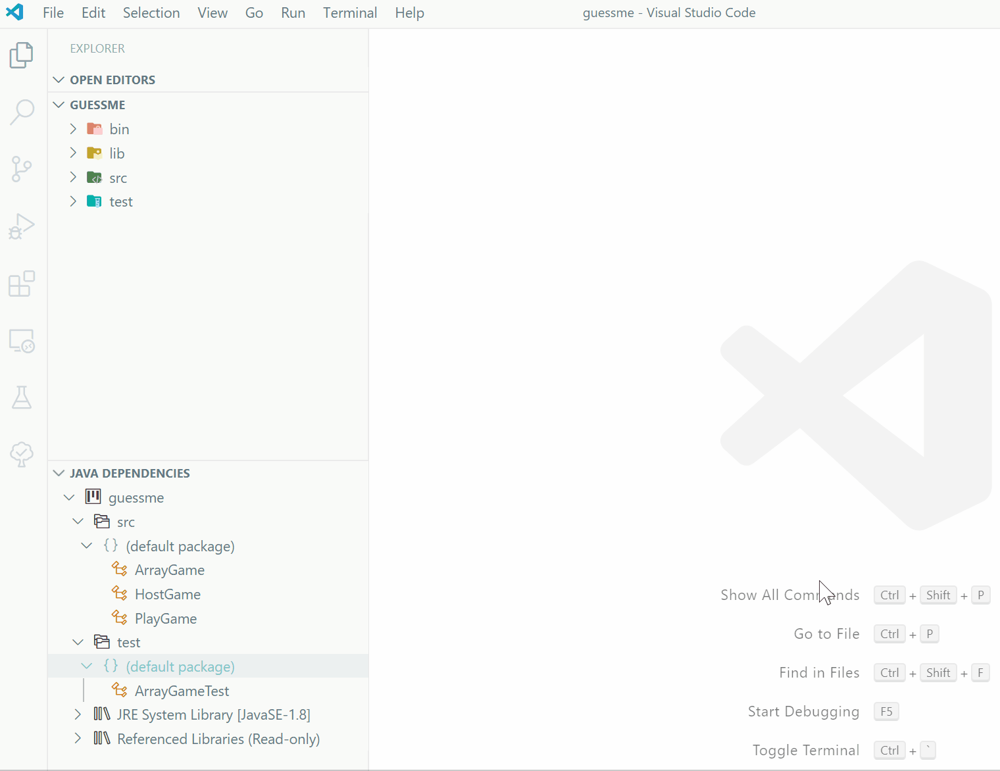
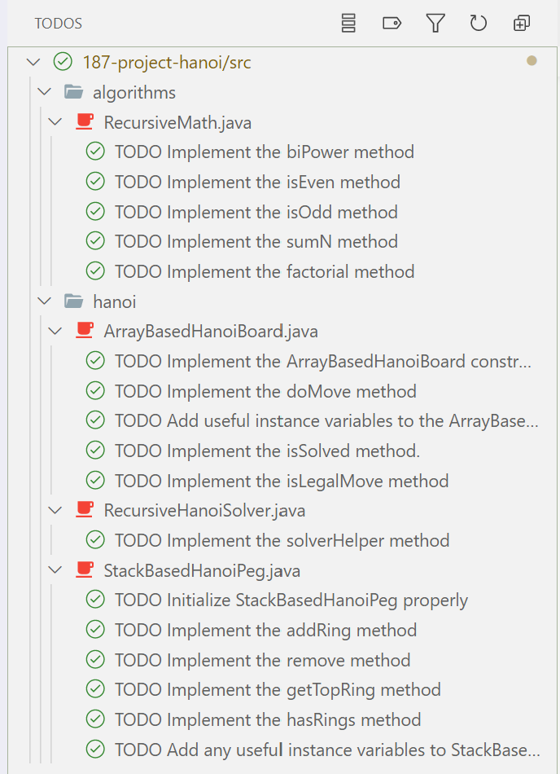
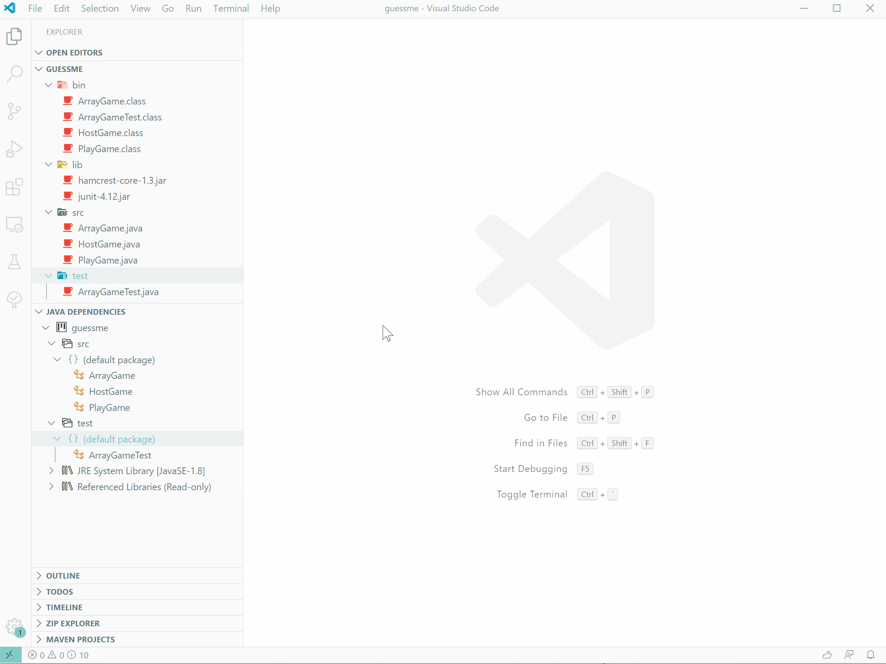
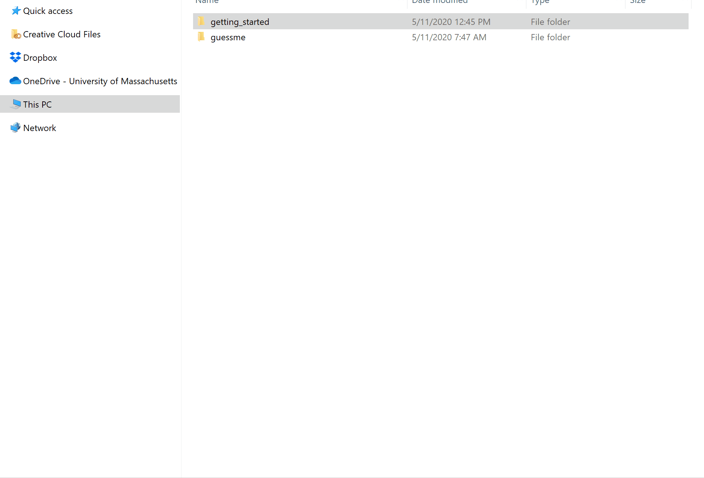
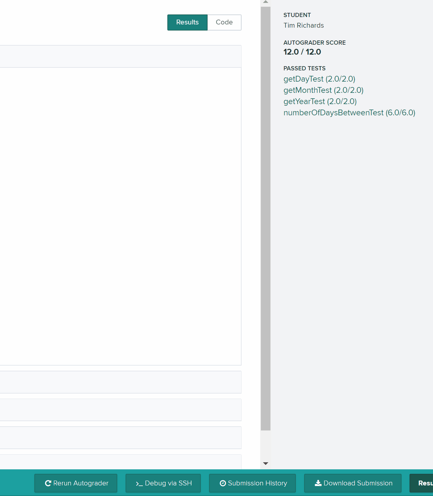

# Overview

A brief paragraph overview of the project.

# Learning Objectives

1. Learning objective 1
2. Learning objective 2
3. Learning objective 3
4. Learning objective 4

# Getting Started

To get started, follow these steps:

1. Create a new folder for the project. Make sure the name of your folder does not include any spaces or punctuation characters as this may confuse the autograder. For example, "project_n" works fine as there are no spaces and it uses an underscore (which is acceptable).
2. Download the [starter code](project.zip) for the project you must move the zip archive file into the folder you created in the previous step.
3. Unzip the starter zip archive on your platform. You can do this on all operating systems by right clicking on the zip file and select to extract all files.

If you follow the above steps correctly, you should have the following folder structure after unzipping (assuming the project name is "project_n"):

```
project_n/
    .vscode
    lib
    src
```

After you have extracted the project folder, open the project folder in VSCode:



Select the project folder and open it up in VSCode. Before you do anything else make sure you explore the project to become acquainted with where things are (note the image below may or may not be this project, you get the idea though):



# Code Structure

This project contains the following important folders:

* **src**: This is the source folder where all code you are submitting must go. You can change anything you want in this folder (unless otherwise specified in the problem description and in the code we provide), you can add new files, etc.
* **src/test**: This is the package folder where you can find all of the public unit tests.
* **lib**: This is where you can find libraries that are included with the project. At the very least you will find two jar files that are used to run the JUnit test framework.

If you are missing any of these folders or if errors are present in your project after you load it into VSCode, unless explicitly specified by the project documentation, seek help immediately so you can get started on the project right away.

# Testing

In the `src/test` directory, we provide a `ProjectTests.java` file containing several JUnit test cases that will help you keep on track while completing the assignment. We recommend you run the tests often and use them to help create a checklist of things to do next. But you should be aware that we deliberately do not provide you the full test suite we use when grading.

We recommend that you think about possible cases and add new `@Test` cases to the `ProjectTests.java` file as part of your programming discipline. Simple tests to add will consider questions such as:

* Do your methods handle edge cases such as integer arguments that may be positive, negative, or zero. Many methods only accept arguments that are in a particular range.
* Does your code handle unusual cases, such as empty or maximally-sized data structures?

More complex tests will be assignment-specific. To build good test cases, think about ways to exercise methods. Work out the correct result for a call of a method with a given set of parameters by hand, then add it as a test case. Note that we will not be looking at your test cases (unless otherwise specified by the assignment documentation), they are just for your use.

Before submitting, make sure that your program compiles with and passes all of the original tests. If you have errors in these files, it means the structure of the files found in the `src` directory may have been altered in a way that will cause your submission to lose some (or all) points.

# General Information and Project Policies

* Read this entire document. If, after a careful reading, something seems ambiguous or unclear to you, then communicate to the course staff immediately. Start this assignment as soon as possible. Do not wait until 5pm the night before the assignment is due to tell us you don’t understand something, as our ability to help you will be minimal.
* For some assignments, it will be useful for you to write additional java files. Any java file you write that is used by your solution MUST be in the provided src directory you export.
* The course staff are here to help you figure out errors, but not solve them for you. When you submit your solution, be sure to remove all compilation errors from your project. Any compilation errors in your project will cause the autograder to fail, and you will receive a zero for your submission. No Exceptions!
* You may not use any of the classes from the Java Platform API that implement the Collection interface (or its sub-interfaces, etc.). Doing so will be viewed as an attempt to cheat.
* **Reminder**: Copying partial or whole solutions, obtained from other students or elsewhere, is academic dishonesty. Do not share your code with your classmates, and do not use your classmates' code. If you are confused about what constitutes academic dishonesty you should re-read the course policies. We assume you have read the course policies in detail and by submitting this project you have provided your virtual signature in agreement with these policies.

# TODOs

Each project clearly outlines where you need to make changes in the source code. We do this using comments with the word TODO written in the comment. Most IDEs typically recognize TODO comments and provide an interface for navigating each TODO. VSCode has the [Todo Tree](https://marketplace.visualstudio.com/items?itemName=Gruntfuggly.todo-tree) extension which you should have already installed. Here is an example of what it looks like in a typical project:



# Project Details

Details about the project. Followed by the problems that students must solve to complete the project successfully.

## Problem 1: The First Problem to Work On

Documentation for the first problem.

## Problem 2: The Second Problem to Work On

Documentation for the second problem.

## Problem N: The Nth Problem to Work On

Documentation for the nth problem.

# Archive VSCode Project and Submit to Autograder

Exporting your project code from VSCode to be submitted to Gradescope is easy! There are two ways to do this:

1. Within VSCode click on the “View > Command Palette…” menu option. Then type into the Command Palette: “Archive Folder” and hit enter. This will produce a Zip file of your src directory. You can then upload that Zip file to the corresponding project assignment in Gradescope.

    

2. Navigate to your project folder using Explorer in Windows, Finder in MacOS, or an equivalent in Linux. Right-click on the src folder and select the appropriate menu item for your operating system. For MacOS look at this, for windows look at this, for Ubuntu Linux look at this. You can then upload that Zip file to the corresponding project assignment in Gradescope.

    

After you submit to Gradescope the autograder will run and give you a report on which tests passed and what your score is. You may submit to Gradescope as many times as you would like before the project due date. In addition, you can select which submission version of your project Gradescope will take as your final score. This is useful in the event that a more recent version introduces problems and lowers a previous score.



If you encounter any errors that look like the autograder failed and not your project, please let the instructors know as soon as possible so we can resolve any issues before it is too late.
